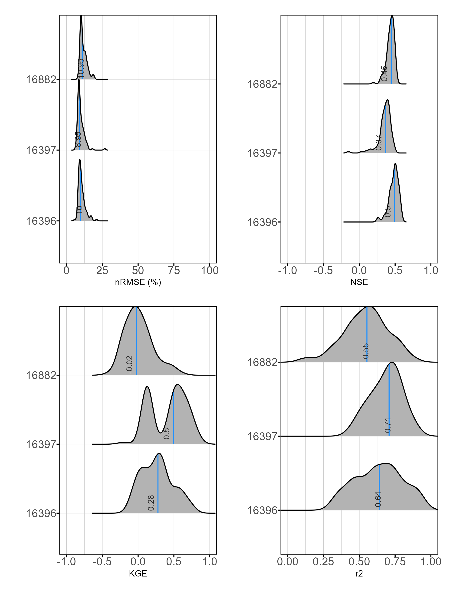

```{r setup, include=FALSE, cache=FALSE}
library(ggplot2)
library(tibble)
library(tidyr)
library(dplyr)
library(mgcv)
library(forcats)
library(mvnfast)
library(purrr)
library(gganimate)
library(gratia)
library(readr)
library(patchwork)
library(RefManageR)
library(hrbrthemes)
library(htmltools)
library(katex)

options(htmltools.dir.version = FALSE,
        htmltools.preserve.raw = FALSE)
knitr::opts_chunk$set(cache = TRUE, dev = 'ragg_png', echo = FALSE, message = FALSE, 
                      warning = FALSE, fig.height=6, fig.width = 1.777777*6, dpi = 300)
BibOptions(check.entries = FALSE,
           bib.style = "authoryear",
           cite.style = "authoryear",
           style = "markdown",
           hyperlink = FALSE,
           dashed = FALSE)

bib <- ReadBib("bibliography.bib", check = "error")

## constats
anim_width <- 1.77777*6
anim_height <- 6
anim_dev <- 'ragg_png'
anim_res <- 300
anim_units = "in"

theme_ms <- function(...) {
  theme_ipsum_rc(plot_margin = margin(10,10,10,10),
              axis_title_just = "c") +
    theme(legend.position = "bottom",
          panel.background = element_rect(fill = "transparent", 
            colour = NA), 
          panel.border = element_rect(fill = NA, 
            colour = "grey20"),
          plot.title = element_text(size = 11,
                                    face = "plain"),
          ...)
}

```

```{r xarigan-themer, include=FALSE, warning=FALSE}
library(xaringanthemer)
style_mono_accent(base_color = "#0054a4",
                  text_font_family = "Open Sans",
                  header_font_url = "custom-fonts.css",
                  header_font_family = "Open Sans Condensed Bold")

```


# Project Drivers

- DAR works well under most circumstances for predicting the FDC `r Citep(bib, c("ries_methods_2000", "asquith_statewide_2006"))`;

--

- Rarely more than a handful of instantaneous streamflow measurements to "validate" data (mean daily streamflow ≠ instantaneous streamflow);

--

- We also often want daily streamflow estimates, this works best with a gage in the same watershed where daily peaks are more likely to correspond;

---
# Project Drivers

- SWAT is well established and accepted, especially in rural watersheds (many new extensions to incorporate groundwater, stormwater networks, etc.) `r Citep(bib, "arnold_swat2000_2005")`;

--

- Issue of validation in ungaged watersheds still exists;

--

- Often calibrated to downstream gages on mainstem reaches that may or may not be reflective of the subwatershed of interest;

---
# Project Drivers

- Can we efficiently provide mean daily streamflow measurements to validate streamflow estimation methods/models?

--

- DAR is a desirable approach: simple, reproducible, acceptable;

--

- If DAR doesn't perform well do we have options to estimate streamflow other than the numerous numeric models that require substantial overhead and are somewhat difficult to interpret?

---

- Physical (numeric) models: lumped hydrologic models, distributed hydrologic models etc.

  - varying degrees of interpretibility, high data requirements, great for forecasting or predicting outside of calibration data range

--

- Statistical methods: Linear regression, semi-parametric regression, etc.

  - higher interpretibility, lower data requirements, not always great for forecasting

--

- Machine learning (statistical) methods: ANN, regression trees, ...

  - low interpretibility, lower data requirements (?), popular in forecasting and prediction

---

# Methods

--

## 1: Develop mean daily streamflow period of record;

--

## 2: Evaluate DAR, linear regression, and semi-parametric regression for estimating streamflow records at site of interest.

---

# Methods

## Develop 1-Yr Mean Daily Streamflow Period-of-Record

.pull-left[
```{r HOBO, echo=FALSE, out.width="90%"}

```
]

.pull-right[

- Record 15-minute stream depths using HOBO Water Level Logger


- pressure transducer deployed instream and separate pressure transducers deployed to measure atmospheric pressure.

]


---

# Methods

## Develop 1-Yr Mean Daily Streamflow Period-of-Record

.pull-left[
```{r IQPlus, echo=FALSE, out.width="90%"}

```
]

.pull-right[
- Measure 15-minute streamflows using Sontek IQ Plus (Bottom mount acoustic doppler velocity meter);


- Periodic deployments, utilizes proprietary index velocity method to calculate streamflow over the chosen interval.
]

---
# Methods

## Develop 1-Yr Mean Daily Streamflow Period-of-Record

.pull-left[
```{r ratingcurve-example, echo=FALSE, out.width="90%"}
knitr::include_graphics("images/rating-curve-example.png")
```
]

.pull-right[
- Develop rating curves relating flow and depth over the course of the year


- Power function:

`r katex_html("Q = K(H-H_0)^z", include_css = TRUE)`


- parameterize `r katex_html("K", displayMode = FALSE)`, `r katex_html("H_0", displayMode = FALSE)`, and `r katex_html("z", displayMode = FALSE)` using non-linear least square (minimize SSE).

]

  
---
# Methods

## Develop 1-Yr Mean Daily Streamflow Period-of-Record

.pull-left[
Unsteady flow:

```{r jones-example, echo=FALSE, out.width="75%"}

```

Figure from `r Citet(bib, "petersen-overleir_modelling_2006")`
]

.pull-right[

- For unsteady flows use the modified Jones Formula:

`r katex_html("Q = K(h-a)^n\\times\\sqrt{1 + x\\frac{\\partial h}{\\partial t}}")`  

- parameterize `r katex_html("K", displayMode = FALSE)`, `r katex_html("a", displayMode = FALSE)`, `r katex_html("n", displayMode = FALSE)`, `r katex_html("x", displayMode = FALSE)`;

- `r katex_html("\\frac{\\partial h}{\\partial t}", displayMode = FALSE)` is the "rate of change" in stream height as a given time.
  
`r Citep(bib, c("petersen-overleir_modelling_2006", "zakwan_spreadsheet-based_2018"))`
]

???
Looped rating curves (aka hysteresis) are a result of unsteady flow effects, shifts in the channel bed, flat slopes with backwater effects, tidal effects, 

---
# Methods

## Develop 1-Yr Mean Daily Streamflow Period-of-Record

.pull-left[
- Fit one or more rating curves to the data based on visual inspection of the time series record;

- Changes in channel shape, vegetation, etc. will alter the rating curve and can necessitate updating the curve throughout the year;
]

.pull-right[
```{r shift-example, echo=FALSE, out.width="90%"}

```
]
  
---
# Methods

## Develop 1-Yr Mean Daily Streamflow Period-of-Record

- Use the rating curve to calculate flows from the HOBO measured depths;

--

- 15-minute streamflow record is aggregated to mean daily streamflow.

---
# Methods

## Evaluate methods for estimating daily streamflows

- Information transfer methods

--
  - Statistical or algebraic transfer of runoff data from one watershed to another
  
--
  - DAR
  
`r katex_html("Q_y^t = Q_x^t\\bigg(\\frac{A_y}{A_x}\\bigg)^\\phi")` 
  
--

  - Linear regression between gaged site and ungaged site

`r katex_html("Q_y = \\beta_0 + \\beta_1X_1 + \\varepsilon")` 

---
# Methods

## Evaluate methods for estimating daily streamflows

- Information transfer methods

  - Assumes similar precipitation and rainfall-runoff characteristics

--
  - Generally performs well for FDC estimation, but estimating daily streamflow values require a well-chosen gaged site.

---

# Methods

## Evaluate methods for estimating daily streamflows

- Semi-parametric rainfall-runoff regression

  - Generalized Additive Model (GAM) is an extension of the Generalized Linear Model (GLM) that incorporates nonlinear forms of the predictor variables. The advantage of generalized models over linear regression models is the ability to incorporate different distributions in the error structure and a flexible *link function* that relates the mean of the response to the predictor variables. We know stream flow is restricted to >= 0 and has a extremely skewed distribution. By selecting the appropriate family and link structure we can restrict the response to the positive space.
  
  - GAMs also allow nonlinear relationships between the predictor and response variables.
  

`r katex_html("Q_y = \\beta_0 + f(x_1) + \\varepsilon")`

  - **WHAT?!**
  
---

```{r basis-function-anim, echo=FALSE}
f <- function(x) {
    x^11 * (10 * (1 - x))^6 + ((10 * (10 * x)^3) * (1 - x)^10)
}
draw_beta <- function(n, k, mu = 1, sigma = 1) {
    rmvn(n = n, mu = rep(mu, k), sigma = diag(rep(sigma, k)))
}
weight_basis <- function(bf, x, n = 1, k, ...) {
    beta <- draw_beta(n = n, k = k, ...)
    out <- sweep(bf, 2L, beta, '*')
    colnames(out) <- paste0('f', seq_along(beta))
    out <- as_tibble(out)
    out <- add_column(out, x = x)
    out <- pivot_longer(out, -x, names_to = 'bf', values_to = 'y')
    out
}
random_bases <- function(bf, x, draws = 10, k, ...) {
    out <- rerun(draws, weight_basis(bf, x = x, k = k, ...))
    out <- bind_rows(out)
    out <- add_column(out, draw = rep(seq_len(draws), each = length(x) * k),
                      .before = 1L)
    class(out) <- c("random_bases", class(out))
    out
}
plot.random_bases <- function(x, facet = FALSE) {
    plt <- ggplot(x, aes(x = x, y = y, colour = bf)) +
        geom_line(lwd = 1, alpha = 0.75) +
        guides(colour = FALSE)
    if (facet) {
        plt + facet_wrap(~ draw)
    }
    plt
}
normalize <- function(x) {
    rx <- range(x)
    z <- (x - rx[1]) / (rx[2] - rx[1])
    z
}
set.seed(1)
N <- 500
data <- tibble(x     = runif(N),
               ytrue = f(x),
               ycent = ytrue - mean(ytrue),
               yobs  = ycent + rnorm(N, sd = 0.5))
k <- 10
knots <- with(data, list(x = seq(min(x), max(x), length = k)))
sm <- smoothCon(s(x, k = k, bs = "cr"), data = data, knots = knots)[[1]]$X
colnames(sm) <- levs <- paste0("f", seq_len(k))
basis <- pivot_longer(cbind(sm, data), -(x:yobs), names_to = 'bf')

sm2 <- smoothCon(s(x, k = k, bs = "cr"), data = data, knots = knots)[[1]]$X
beta <- coef(lm(ycent ~ sm2 - 1, data = data))
wtbasis <- sweep(sm2, 2L, beta, FUN = "*")
colnames(wtbasis) <- colnames(sm2) <- paste0("F", seq_len(k))
## create stacked unweighted and weighted basis
basis <- as_tibble(rbind(sm2, wtbasis)) %>%
    add_column(x = rep(data$x, times = 2),
               type = rep(c('unweighted', 'weighted'), each = nrow(sm2)),
               .before = 1L)
##data <- cbind(data, fitted = rowSums(scbasis))
wtbasis <- as_tibble(rbind(sm2, wtbasis)) %>%
    add_column(x      = rep(data$x, times = 2),
               fitted = rowSums(.),
               type   = rep(c('unweighted', 'weighted'), each = nrow(sm2))) %>%
    pivot_longer(-(x:type), names_to = 'bf')
basis <- pivot_longer(basis, -(x:type), names_to = 'bf')
p3 <- ggplot(data, aes(x = x, y = ycent)) +
    geom_point(aes(y = yobs), alpha = 0.2) +
    geom_line(data = basis,
              mapping = aes(x = x, y = value, colour = bf),
              lwd = 1, alpha = 0.5) +
    geom_line(data = wtbasis,
              mapping = aes(x = x, y = fitted), lwd = 1, colour = 'black', alpha = 0.75) +
    guides(colour = FALSE) +
    labs(y = 'f(x)', x = 'x') +
  theme_ms()

crs_fit <- animate(p3 + transition_states(type, transition_length = 4, state_length = 2) + 
                   ease_aes('cubic-in-out'),
                   nframes = 100, 
                   height = anim_height, 
                   width = anim_width, 
                   res = anim_res,
                   units = anim_units,
                   dev = anim_dev)
anim_save('images/gam-crs-animation.gif', crs_fit)

```


**GAMs fit wobbly lines (smooth functions) to the data**


```{r wobbly, echo=FALSE, out.width="90%"}
knitr::include_graphics("images/gam-crs-animation.gif")
```

???

GAMs use splines to represent the non-linear relationships between covariates, here `x`, and the response variable on the `y` axis.

Splines are built up from basis functions

Here I'm showing a cubic regression spline basis with 10 knots/functions

We weight each basis function to get a spline. Here all the basis functions have the same weight so they would fit a horizontal line

But if we choose different weights we get more wiggly spline

Fitting a GAM involves finding the weights for the basis functions that produce a spline that fits the data best, subject to some constraints

---
**Too wobbly or not wobbly enough?**

```{r out.width="90%"}
### Simulated data
x <- seq(0,2*pi,0.1)
z <- sin(x)
y <- z + rnorm(mean=0, sd=0.5*sd(z), n=length(x))
d <- cbind.data.frame(x,y,z)

d1 <- cbind.data.frame(data.frame(predict(smooth.spline(x=d, spar=0), x)), z)
e <- sqrt(sum((d1$z-d1$y)**2))
p1 <- ggplot(data=d, aes(x=x, y=y)) + geom_point() + geom_line(data=d1, aes(x=x, y=y), linetype=1) + geom_line(aes(x=x, y=z), linetype=2) + theme_ms()

d2 <- cbind.data.frame(data.frame(predict(smooth.spline(x=d, spar=0.3), x)), z)
e <- sqrt(sum((d2$z-d2$y)**2))
p2 <- ggplot(data=d, aes(x=x, y=y)) + geom_point() + geom_line(data=d1, aes(x=x, y=y), linetype=1) + geom_line(aes(x=x, y=z), linetype=2) + theme_ms()

d3 <- cbind.data.frame(data.frame(predict(smooth.spline(x=d, spar=0.6), x)), z)
e <- sqrt(sum((d3$z-d3$y)**2))
p3 <- ggplot(data=d, aes(x=x, y=y)) + geom_point() + geom_line(data=d3, aes(x=x, y=y), linetype=1) + ylab("") + geom_line(aes(x=x, y=z), linetype=2) + theme_ms()

d4 <- cbind.data.frame(data.frame(predict(smooth.spline(x=d, spar=1), x)), z)
e <- sqrt(sum((d4$z-d4$y)**2))
p4 <- ggplot(data=d, aes(x=x, y=y)) + geom_point() + geom_line(data=d4, aes(x=x, y=y), linetype=1) + ylab("") + geom_line(aes(x=x, y=z), linetype=2) + theme_ms()

(p1 + p2)/(p3 + p4)

```

???

Here we show the smooth function in a GAM constrained to different levels of smoothing. The dotted line is the underlying true function (a sine curve) and the points are randomly generated by the function but with a normally distributted random error.

The first plot predicts the data best, but is harder to explain and has a higher variance from the underlying sine function that describes the true data. As we smooth the curve, the variance decreases but our in-sample error increases. GAMs assist with finding the balance between overfitting the data and creating a curve that is too smooth and misses important patterns in the underlying data.

---

.left-column[
### Nutrient Load Prediction
]

.right_column[
.center[
```{r hagemann-example, echo=FALSE, out.width="50%"}

```

`r Citep(bib, "hagemann_estimating_2016")`
]
]

???
This was probably the first published application I came across using GAMs in a water quality context. This study used GAMs to model daily nutrient concentrations for a stream that fed a drinking water reservoir. 

---

.left-column[
### Nutrient Load Prediction

### Chesapeake Bay Program


]

.right_column[
.center[
```{r murphy-example, echo=FALSE, out.width="50%"}
knitr::include_graphics("images/murphy-example.png")
```

`r Citep(bib, "murphy_generalized_2019")`
]
]

???
The Chesapeake Bay Program has been using GAMs to model and assess nutrient concentrations in the Bay as part of the Bay TMDL. This figure shows modeled concenctration, modeled average concentrations, and flow adjustments used to compare concentrations between years.

---

.left-column[
### Nutrient Load Prediction 

### Chesapeake Bay Program 

### Discharge/Velocity Prediction

]

.right_column[
.center[
```{r asquith-example, echo=FALSE, out.width="50%"}

```

`r Citep(bib, "asquith_generalized_2013")`
]
]

???
USGS study to predict the mean discharge and velocity of streams during direct runoff conditions (~95% exceedance).

It is difficult to see on these maps, but they are showing lower stream velocities in eastern streams compared to western streams. Probably attributable to vegetation and stream morphology.

---

.left-column[
### Nutrient Load Prediction 

### Chesapeake Bay Program 

### Discharge/Velocity Prediction 

### Environmental Mitigation 

]

.right_column[
.center[
```{r schramm-example, echo=FALSE, out.width="30%"}
knitr::include_graphics("images/Schramm-example.png")
```

`r Citep(bib, "schramm_effects_2017")`
]
]
???
Before I joined TWRI, I worked on the hydropower program for DOE at Oak Ridge National Lab. We did studies on environmental mitigation and planning for hydropower production. This study looked at how fish respond to hydrokinetic turbine noise. We used GAMs to assess and predict if fish are avoid or are attracted to the sound produced by turbines. GAMs were essential for modelling this non-linear response.

---

.left-column[
### Nutrient Load Prediction 

### Chesapeake Bay Program 

### Discharge/Velocity Prediction 

### Environmental Mitigation 

### Upper Llano Watershed 
]


.right_column[
.center[
```{r schramm-llano, echo=FALSE, out.width="30%"}

```

`r Citep(bib, "schramm_escherichia_2018")`
]
]
???
Another water quality example, we used GAMs to model and describe trends in various water quality parameters in the Upper Llano watershed. Here we show the non-linear response of E.coli concentrations to flow over time and by season. We were able to show seasonal decreases under certain conditions.

---

## GAM

`r katex_html("Q = f(P) + f(T) + f(P_{lag,1}) + f(P_{sum,3}) + f(T_{mean,5}) + f(H) + f(M)")`


 
 - `r katex_html("f() =", displayMode = FALSE)` some unknown smoothing function
 
 - `r katex_html("P =", displayMode = FALSE)` log(Precipitation + 1)
 
 - `r katex_html("T =", displayMode = FALSE)` squared max temp
 
 - `r katex_html("P_{lag,1} =", displayMode = FALSE)` 1 day lag P
 
 - `r katex_html("P_{sum,3} =", displayMode = FALSE)` 3 day sum rainfall
 
 - `r katex_html("T_{mean,5} =", displayMode = FALSE)` 5 day mean T_max_
 
 - `r katex_html("H =", displayMode = FALSE)` Relative Humidity
 
 - `r katex_html("M =", displayMode = FALSE)` Month

---

# Results


---


.pull-left[
**Rating Curve: 16396 Thompsons @ Silver Hill Rd**

```{r metricplot16396-1, echo=FALSE, out.width="90%"}

```
]

.pull-right[
**Rating Curve Parameters & Fit**

| K	| a	| n	| x	| NSE	| nRMSE |
| -  | - | - | - | --- | ----- |
| 4.8077| 0.366 | 0.4816	| -0.1808	| 0.99 | 2.5 |
| 1.5574|	-0.696|	1.3786 |	-0.0786 |	0.73 |	6.8|
| 4.3915|	0.1785|	0.6552 | 0.0808	| 0.97 |	1.8 |
]


---

.pull-left[
## 15-minute Streamflow

```{r instantflow, echo=FALSE, out.width="95%"}

```
]

.pull-right[
## Naturalized Hydrograph

```{r meandaily, echo=FALSE, out.width="70%"}

```

<small>WWTF influences removed</small>

]

---

## DAR results (Thompsons @ Silver Hill Rd.)

.pull-left[
```{r darresults, echo=FALSE, out.width="95%"}

```
]

.pull-right[

| Method | NSE | KGE |
|--------|-----|-----|
| DAR 08065800 | -0.27 | -0.08 |
| DAR 08109800 | 0.25 | -0.36 |
| DAR 08110100 | 0.26 | -0.22 |
]


---

## Linear Regression Results

.pull-left[
```{r lrresults, echo=FALSE, out.width="95%"}

```
]

.pull-right[
| Method | NSE | KGE |
|--------|-----|-----|
| Linear Regression | 0.52 | 0.21 |

]


---

## GAM Results

.pull-left[
```{r gamresults, echo=FALSE, out.width="95%"}

```
]

.pull-right[
| Method | NSE | KGE |
|--------|-----|-----|
| GAM | 0.425 | 0.46|
]


---

## Metrics

### Site 16396

| Method | NSE | KGE |
|--------|-----|-----|
| DAR 08065800 | -0.27 | -0.08 |
| DAR 08109800 | 0.25 | -0.36 |
| DAR 08110100 | 0.26 | -0.22 |
| Linear Regression | 0.52 | 0.21 |
| GAM | 0.425 | 0.46|

---

## Cross-validation

We want to evaluate how this approach works on data outside of the data we fit the models to. Normally, we hold out a portion of data and use it as a test data set. However, we don't have much data.

We use Monte-Carlo Cross Validation:

```{r mccv, echo=FALSE, out.width="75%"}

```


---

.pull-left[
**Linear regression**

```{r cvlm, echo=FALSE, out.width="80%"}

```

]


.pull-right[
**GAM**

```{r cvgam, echo=FALSE, out.width="80%"}

```

]

---
## Flow Duration Curves

.pull-left[
```{r fdc, echo=FALSE, out.width="100%"}

```

]

.pull-right[
```{r predfdc, echo=FALSE, out.width="100%"}

```

]

---


## To Do:

- Revisit rating curves. Over prediction of high flow events might be an issue.

- Explore co-variates (PET) and effects of normalizing streamflows before fitting regression based models

- Compare precipitation driven GAMS to rainfall runoff approaches (HyMOD, SCS-CN, TWDB Rainfall-Runoff model, etc.)

- Explore period of record needed to confidently predict to out of sample data.

---

## Some lessons:

- Site selection is difficult for deploying bottom mount dopplers

- More frequent data, possibly longer (>1 year) sampling would be useful (need to quantify tradeoffs between data collection costs and developing distributed models like SWAT)

- Flow data collected alongside routine data will avoid some of the challenges associated with recreating daily flow records, much easier to estimate flow exceedances and match flows instead of collection dates


---

# References

<small>
```{r refs1, echo=FALSE, results="asis"}
PrintBibliography(bib, start = 1, end = 6)
```
</small>

---

# References (cont.)
<small>
```{r refs2, echo=FALSE, results="asis"}
PrintBibliography(bib, start = 7, end = length(bib))
```
</small>

---
**Extra Slides**

---

```{r smoothers, echo=FALSE, out.width="95%"}

```


---

**GAM Summary 16396**

| Component |	Term	| Estimate	| Std Error | t-value |	p-value |
|-----------|-------|-----------|-----------|---------|---------|
|A. parametric coefficients |	(Intercept)	| 2.034 |	0.038 |	53.804 |	\*\*\* |
|Component |	Term	| edf |	Ref. df |	F-value |	p-value |
|B. smooth terms |	s(ewood_precip) |	2.638	| 9.000 |	13.269 |	\*\*\* |
| |	s(ewood_tmax) |	0.000	| 9.000 |	0.000 | |	
|	| s(lagPrecip)	| 0.001	| 9.000	| 0.000	| |
|	| s(wetness)	  |5.372	| 9.000	| 22.621 |	\*\*\* |
|	| s(et)	| 4.383	| 9.000	| 3.662	| \*\*\* |
|	| s(ewood_rh)	| 0.000	| 9.000	| 0.000 |	|
|	| s(month)	| 5.959	| 8.000	| 6.926	| \*\*\* |

Signif. codes: 0 <= '\*\*\*' < 0.001 < '\*\*' < 0.01 < '\*' < 0.05 < '.' < 0.1 < '' < 1

Adjusted R-squared: 0.304, Deviance explained 0.801
-REML : 1114.800, Scale est: 0.553, N: 387


